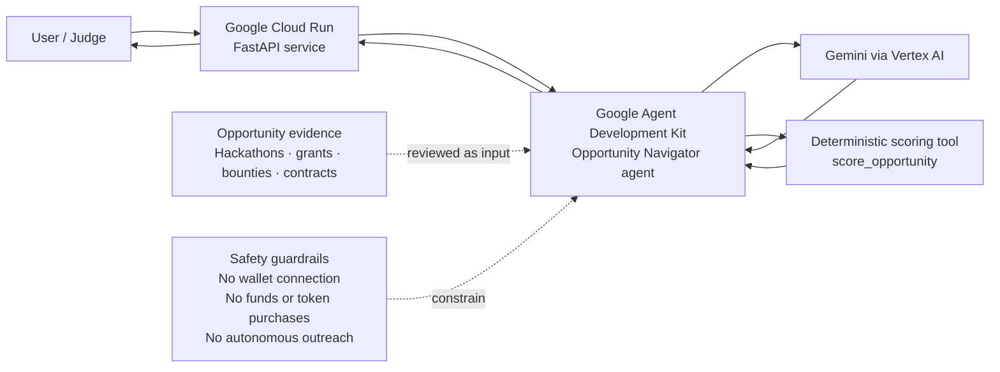

# Opportunity Navigator Architecture

## Request flow

1. A user sends an opportunity-comparison request to the Cloud Run-hosted FastAPI application.
2. Google ADK routes the request to the `opportunity_navigator` agent.
3. Gemini reasons over the supplied evidence and decides when deterministic scoring is appropriate.
4. The `score_opportunity` tool evaluates expected value, effort, credibility, fit, urgency, and eligibility.
5. The agent returns a concise ranking plus any evidence still required before the user should pursue an opportunity.

## Security and safety boundaries

- The hackathon project is isolated from AION's production owner runtime and private memory.
- No owner credentials, private prompts, or AION production secrets are required by the demo agent.
- No wallet connection, token purchase, live trading, gambling, payment, or sending funds is supported.
- The agent does not contact third parties or submit applications automatically.
- Social and community posts are treated as discovery leads until independently verified by an official source.
